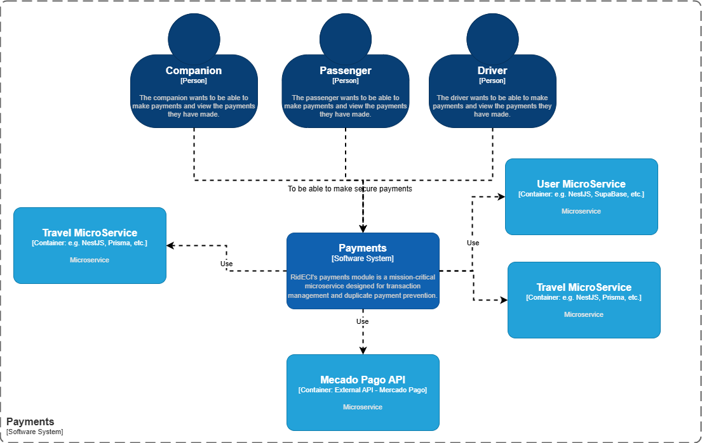
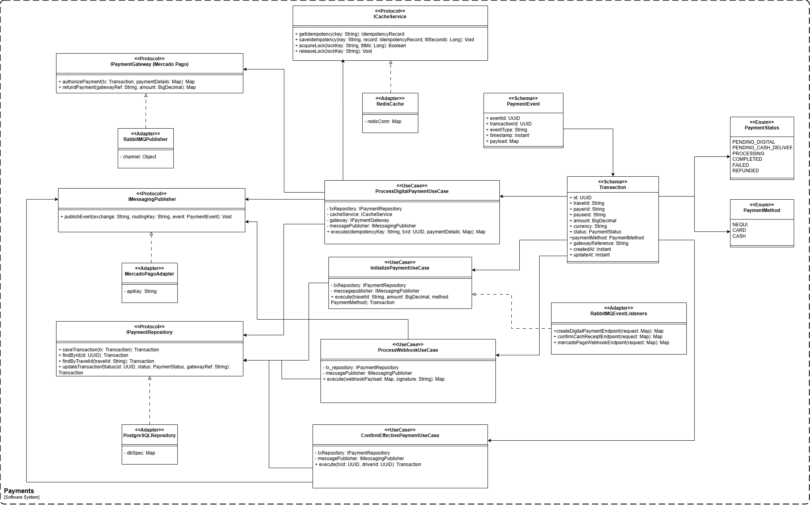
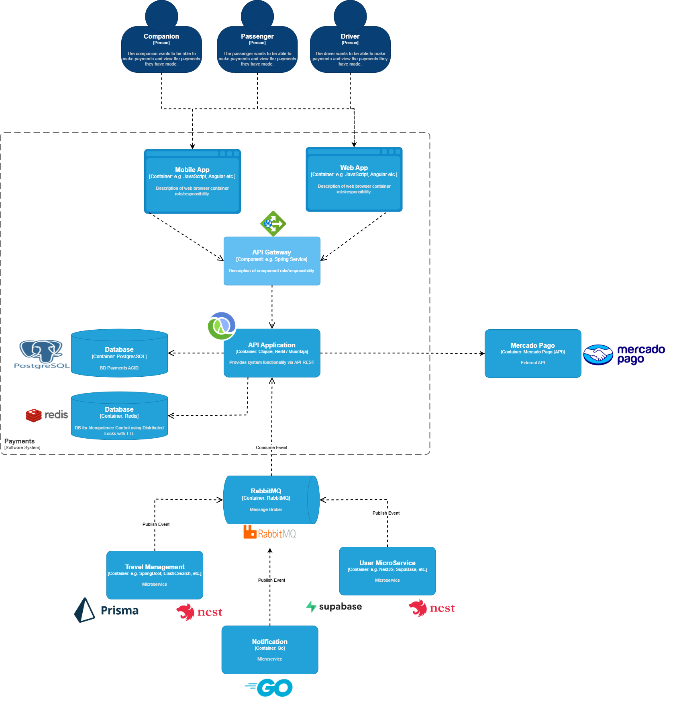
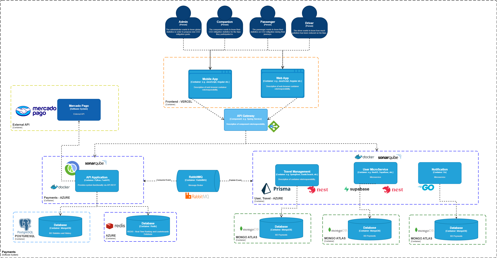
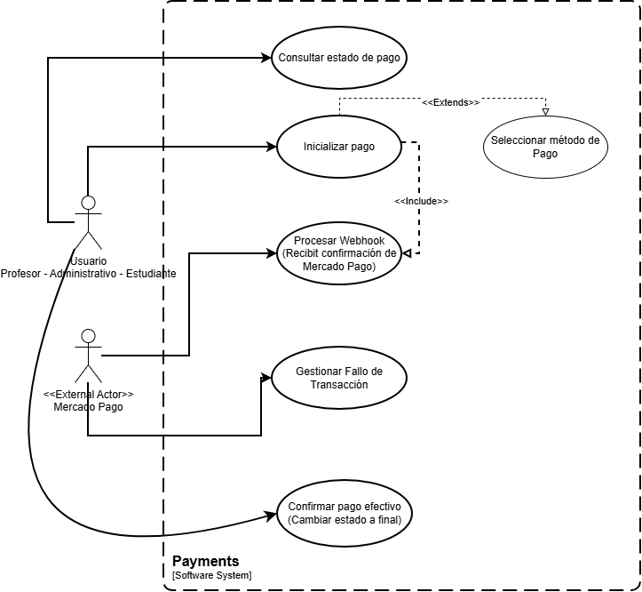
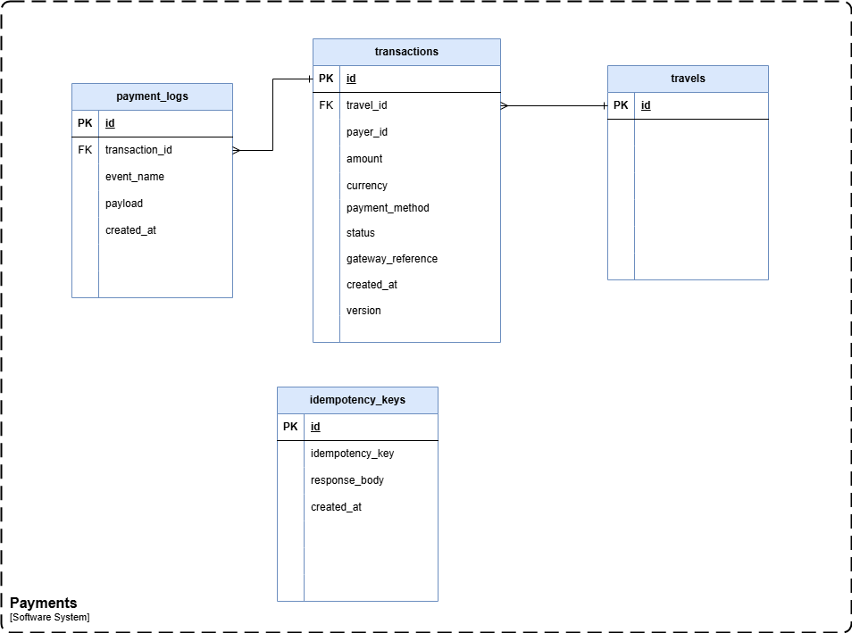

# 🏦🤑💸 Payments Module

RIDECI's payments module is a standalone microservice designed to securely, transactionally, and scalably manage all financial exchanges arising from shared rides within the university community.

---
## 👤 Developers
- Juan Pablo Caballero

---
## 📑 Table of Contents

1. [🏢 Project Architecture](#-project-architecture)
2. [📂 Clean - Hexagonal Structure](#-clean---hexagonal-structure)
3. [📡 API Endpoints](#-api-endpoints)
4. [#️⃣ Input and Output Data](#-input-and-output-data)
    - [1. Initialize Payment Payload (Input)](#1-initialize-payment-payload-input)
    - [2. Payment Transaction Summary (Output)](#2-payment-transaction-summary-output)
5. [🔗 Connections with other Microservices (Asynchronous Communication)](#-connections-with-other-microservices-asynchronous-communication)
6. [🚀 Getting Started](#-getting-started)
7. [📐 System Architecture & Design](#-system-architecture--design)
    - [🧠 Hexagonal Architecture Flow](#-hexagonal-architecture-flow)
    - [🏗️ Class Structure & Domain Model](#️-class-structure--domain-model)
8. [🧩 System Components & Integration Architecture](#-system-components--integration-architecture)
9. [🚀 Deployment & Cloud Infrastructure Architecture](#-deployment--cloud-infrastructure-architecture)
10. [👥 Use Case Analysis (Payments Module)](#-use-case-analysis-payments-module)
11. [🗄️ Database Schema & Data Models (PostgreSQL)](#️-database-schema--data-models-postgresql)
12. [🛠️ Technologies](#️-technologies)
13. [🛡️ Quality Attributes](#️-quality-attributes)
14. [🧪 Testing](#-testing)
---

## 🏢 Project Architecture
The Payments module follows an uncoupled Hexagonal (Clean) Architecture, isolating the core financial orchestration and business logic from external infrastructure dependencies.

* **🧠 Domain (Core):** Contains core entities, state models, and financial validation rules.

* **🎯 Ports (Interfaces):** Functional protocols defining contracts for inbound triggers (Consumers/Controllers) and outbound actions (Gateways/DBs).

* **🔌 Adapters (Infrastructure):** Specific implementations including RabbitMQ async consumers (travel-consumer, user-consumer), REST Controllers, and external payment integration gateways.

---

## 🌟 Module Context

The Context Diagram (C4 Level 1) defines the operational boundaries of **Payments** within the **ridECI** ecosystem. The module functions as a decentralized, mission-critical system that allows users to securely pay their fares. Its primary role is that of a transactional orchestrator that coordinates financial flows, consuming internal resources of the architecture and interacting directly with external payment entities.

* **Actor Interaction:** Passengers, drivers, and companions communicate with the system to execute transactions and view their payment or income records.

* **Consumption of Internal Services:** It integrates with the *Travel MicroService* to validate the physical status of the trip and with the *User MicroService* to verify identity and apply institutional fares.

* **External Banking Integration:** Delegates the actual monetary processing directly to the *Mercado Pago* API through synchronous requests and asynchronous validations via Webhooks.



---

## 📂 Clean - Hexagonal Structure
```
:📂 donkey-kong-payments-service
┣ :📂 src/
┃ ┗ :📂 rideci/
┃ ┃ ┗ :📂 payments/
┃ ┃ ┃ ┣ :📂 domain/                   # Pure domain models and data schemas
┃ ┃ ┃ ┃ ┣ 📄 dtos.clj
┃ ┃ ┃ ┃ ┗ 📄 schemas.clj
┃ ┃ ┃ ┣ :📂 application/              # Orchestrating Core Business Logic
┃ ┃ ┃ ┃ ┗ :📂 use_cases/              # Application use cases
┃ ┃ ┃ ┃ ┃ ┗ 📄 initialize_payment.clj
┃ ┃ ┃ ┣ :📂 ports/                    # Driving/Driven Interface Protocols
┃ ┃ ┃ ┃ ┗ 📄 payment_repository.clj
┃ ┃ ┃ ┣ :📂 configuration/            # Core system & environment initializers
┃ ┃ ┃ ┃ ┣ 📄 config.clj
┃ ┃ ┃ ┃ ┣ 📄 env.clj
┃ ┃ ┃ ┃ ┗ 📄 rabbitmq.clj
┃ ┃ ┃ ┣ :📂 infrastructure/           # Outer Layer: Concrete technical components
┃ ┃ ┃ ┃ ┗ :📂 adapters/
┃ ┃ ┃ ┃ ┃ ┣ :📂 in/                   # Inbound Adapters (Primary / Driving)
┃ ┃ ┃ ┃ ┃ ┃ ┣ 📄 rest_controller.clj
┃ ┃ ┃ ┃ ┃ ┃ ┣ 📄 travel_consumer.clj
┃ ┃ ┃ ┃ ┃ ┃ ┗ 📄 user_consumer.clj
┃ ┃ ┃ ┃ ┃ ┗ :📂 out/                  # Outbound Adapters (Secondary / Driven)
┃ ┃ ┃ ┃ ┃ ┃ ┣ 📄 mercado_pago.clj
┃ ┃ ┃ ┃ ┃ ┃ ┣ 📄 postgres_repository.clj
┃ ┃ ┃ ┃ ┃ ┃ ┣ 📄 rabbitmq_publisher.clj
┃ ┃ ┃ ┃ ┃ ┃ ┗ 📄 redis_cache.clj
┃ ┃ ┃ ┗ 📄 main.clj                   # Application Entry Point
┣ :📂 test/                           # Test suite mirroring the source structure
┣ 📄 deps.edn                         # Clojure CLI dependencies and aliases
┣ 📄 run_coverage.clj                 # Test coverage orchestration & XML reporting
┣ 📄 sonar-project.properties         # SonarQube static analysis configuration
┣ 📄 docker-compose.yml
┗ 📄 README.md
```
---

## 📡 API Endpoints

| Method | URI | Description |
| :--- | :--- | :--- |
| `POST` | `/api/payments/initialize` | Initializes a new payment transaction by orchestrating the user and travel payload. Validates idempotency through Redis, invokes the Mercado Pago gateway, and publishes the initial payment event. |
| `POST` | `/api/payments/confirm-cash` | Confirms and finalizes a cash payment transaction using atomic state updates, then publishes the corresponding notification through RabbitMQ. |
| `GET` | `/api/payments/{id}` | Retrieves the complete transaction details and financial metadata stored in PostgreSQL for a specific transaction identifier. |
| `GET` | `/api/payments/user/{user-id}` | Fetches the complete payment history and associated invoices for a specific user account. |
| `POST` | `/api/payments/webhook` | Receives asynchronous IPN webhook notifications from Mercado Pago to synchronize remote payment status changes. |

---

# #️⃣ Input and Output Data

## 1. Initialize Payment Payload (Input)

| Field | Type | Description |
| :--- | :--- | :--- |
| `travel` | Map / Object | Contains the travel details, including the trip identifier, fare, origin, destination, and other metadata required for payment processing. |
| `user` | Map / Object | Contains the passenger or driver information, including the user identifier, name, and account details required for billing and payment validation. |

## 2. Payment Transaction Summary (Output)

| Field | Type | Description |
| :--- | :--- | :--- |
| `transaction_id` | String | Unique identifier generated for the internal payment transaction. |
| `status` | String / Enum | Current transaction status (e.g., `PENDING`, `AUTHORIZED`, `COMPLETED`, `REJECTED`). |
| `payment_method` | String / Enum | Payment method used to process the transaction (e.g., `MERCADO_PAGO_CREDIT`, `CASH`). |
| `amount` | Float / BigDecimal | Final amount charged and processed by the payment gateway. |
| `version` | Integer | Optimistic locking version used to guarantee atomic updates during transaction processing. |

---

## 🔗 Connections with other Microservices (Asynchronous Communication)
This module functions as both a reactive consumer and an event publisher:

1. **Travel Management (travel-consumer):** Consumes trip events from RabbitMQ (travel.events.queue) to trigger automatically the billing and payment orchestration process for finished rides.

2. **User Management (user-consumer):** Consumes user updates to synchronize cache state, guaranteeing user authentication and role data are fully validated before committing any financial transaction.

3. **Redis Cache:** Enforces distributed idempotency locks to strictly block duplicate payment requests and mitigate double-spending race conditions.

4. **Notification / Notification Publisher:** Dispatches downstream events through RabbitMQ upon successful charge captures or cash confirmations, alerting external microservices to unblock users or update ride statuses.

---

## 🚀 Getting Started
This project uses Clojure (CLI Tools) with Java JRE/JDK 17+.

### Clone & Run 
```bash
git clone https://github.com/RIDECI/donkey-kong-payments-service
cd donkey-kong-payments-service

# Execute the project
clj -M -m rideci.payments.main

# Execute the tests
clj -M:coverage
```

## 📐 System Architecture & Design
This section provides a visual representation of the module's architecture, illustrating the financial orchestration flow, state mutations, and the interaction between async messaging components and external banking gateways.

### 🧠 Hexagonal Architecture Flow
The diagram below illustrates how the Payments module centralizes and secures financial operations. The system intercepts ride events via the RabbitMQ Inbound Consumer or HTTP requests through the REST Controller. These payloads are orchestrated by the Application Use Cases, which enforce strict distributed idempotency checks using the Redis Cache Adapter.

Once validated, the core interacts with the external Mercado Pago Gateway to authorize the transaction, securely persists the ledger state in PostgreSQL using optimistic locking, and dispatches downstream event notifications via the RabbitMQ Publisher.

---

### 🏗️ Class Structure & Domain Model

The Payments module is designed following explicit **Hexagonal Architecture** constraints, decoupling core financial workflows from specific runtime infrastructure layers, cloud providers, and third-party gateways.

### 🧠 1. Domain Layer (Schemas & Core Models)
Located on the right-hand side, this component defines the immutable data contract validations (modeled as Clojure maps with explicit schemas like *Malli* or *Prismatic*).

* **`Transaction` (`<<Schema>>`)**: The central operational entity representing the financial ledger snapshot. It retains key correlation identifiers (`id`, `travelId`, `payerId`, `payeeId`), monetary values (`amount`, `currency`), strict domain tracking states (`status`, `paymentMethod`), and optimistic locking fields (`version` or transaction timestamps).
* **`PaymentEvent` (`<<Schema>>`)**: The structured message payload format designated for asynchronous downstream propagation across distributed systems.
* **Enums (`PaymentStatus` & `PaymentMethod`)**: Domain boundaries enforcing exact transactional life-cycle states (`PENDING_DIGITAL`, `PROCESSING`, `COMPLETED`, `FAILED`, etc.) and accepted settlement methods (`NEQUI`, `CARD`, `CASH`).

### 🎯 2. Application Layer (Orchestrating Use Cases)
Positioned in the center (`<<UseCase>>`), these blocks model pure business orchestration rules. They are technologically agnostic and rely entirely on abstract protocols to drive external behavior.

* **`InitializePaymentUseCase`**: Evaluates early validation flags for incoming travel routing scenarios to kick off either digital authorization or cash-on-delivery tracking.
* **`ProcessDigitalPaymentUseCase`**: Handles critical online processing pipelines. It orchestrates sub-millisecond distributed locks via cache ports to enforce strict idempotency, triggers external capture flows, and signals real-time event updates.
* **`ConfirmEffectivePaymentUseCase`**: Manages atomic settlement balances for physical cash (`CASH`) overrides once drivers or operations confirm local fee collection.
* **`ProcessWebhookUseCase`**: Processes out-of-band asynchronous status confirmations dispatched by the external transaction clearing network to settle pending transactions.

### 🎯 3. Ports Layer (Abstract Domain Protocols)
Represented by the green blocks (`<<Protocol>>`). In Clojure, these map directly to `defprotocol` declarations, defining decoupled interface signatures that isolation layers must satisfy.

* **`ICacheService`**: Enforces strict operational safety invariants (`getIdempotency`, `saveIdempotency`, `acquireLock`, `releaseLock`) to prevent double-spending and multi-threaded race conditions.
* **`IPaymentGateway`**: Abstracts the interface of the payment collection engine (e.g., Mercado Pago), isolating token authorization and refunds from implementation quirks.
* **`IMessagingPublisher`**: Models the functional output channel contract required to drop message envelopes safely into reactive event queues.
* **`IPaymentRepository`**: Standardizes persistent ledger access patterns (`saveTransaction`, `findByTravelId`, `updateTransactionStatus`) independently of SQL/NoSQL storage engines.


### 🔌 4. Infrastructure Layer (Concrete Tech Adapters)
Represented by the yellow blocks (`<<Adapter>>`). This layer implements concrete drivers, network connections, and cloud targets configured during application bootstrap.

* **`RabbitMQEventListeners` (Inbound / Driving)**: Intercepts active network event queues, transforming transient wire messages into clean, validated schema types before handing execution control to application use cases.
* **Outbound / Driven Adapters**:
    * **`RedisCache`**: Concrete implementation of `ICacheService` that leverages an open Redis client context (`redisConn`) to track globally shared locks.
    * **`MercadoPagoAdapter`**: Encapsulates external HTTP API payload packing and token signature handshakes using localized access keys (`apiKey`).
    * **`PostgreSQLRepository`**: Binds the `IPaymentRepository` interface to active relational database connections (`dbSpec`), evaluating SQL constraints and driving state isolation level logic.
    * **`RabbitMQPublisher`**: Implements `IMessagingPublisher` to execute low-level AMQP channel publishing operations.



---

## 🧩 System Components & Integration Architecture

The Payments Module acts as a high-performance, transactional service within the ecosystem. It is containerized via **Docker**, monitored with **SonarQube**, and interacts reactively via event-driven messaging and synchronous REST interfaces.

---

### 📦 1. Core Component: Payments Module
The central core of this service is built on **Clojure (JVM)**, capitalizing on functional paradigms to orchestrate payment statuses seamlessly.
* **Technology Stack**: Clojure, Docker, Spring/SH (Hiccup/Component orchestration tooling), and SonarQube quality gates.
* **Responsibilities**: Orchestrating distributed state machines for trips, enforcing transactional idempotency, and calling payment clearinghouses.

### 📡 2. Inbound & API Routing (Ingress)
* **RIDECI Frontend**: The client application interacting with the microservices.
* **API Gateway**: Centralizes HTTP requests, acting as a security and routing proxy layer. It targets the **Payments Module** synchronously for real-time checkouts (`/initialize`, `/confirm-cash`) and transfers external payment gateway webhook payloads.

### 🔄 3. Asynchronous Communication (Message Broker)
* **Message Broker (RabbitMQ)**: The reactive backbone handling decouple patterns.
    * **Inbound Streams**: The **Travel Module** (built on *NestJS* & *Prisma*) drops trip completion events into RabbitMQ, which are subsequently consumed by the Payments Module (`travel-consumer`).
    * **Outbound Streams**: Upon successful processing or confirmation of a transaction, the Payments Module fires downstream completion events back to the broker. These are consumed by the **Notifications Module** (built on *Go*) to alert drivers and riders in real time.

### 🗄️ 4. Data Persistence & Distributed Invariant Caching (Azure)
The module separates high-performance storage concerns by managing two distinct data nodes hosted on cloud infrastructure:

* **Relational DB - ACID (PostgreSQL)**: Handles the persistent, audited ledger entries of transaction states. It leverages relational constraints and version counters to safeguard financial logs against overlapping database writes.
* **Fast Caches (Redis)**: Act as a sub-millisecond layer dedicated to tracking distributed locks. It serves to intercept incoming requests instantly, resolving multi-threaded race conditions or duplicate vendor webhook pushes before hitting the core thread pool.

### 🏦 5. External Settlement Layer
* **API External (Mercado Pago)**: External clearing network integrated via outbound adapters. The Payments Module handles secure token handshakes to capture card or digital balance amounts synchronously, returning immediate processing responses to the API Gateway.



---

## 🚀 Deployment & Cloud Infrastructure Architecture

The RIDECI platform architecture is deployed utilizing enterprise-grade cloud topologies on **Microsoft Azure**, isolating services inside secure virtual boundaries while exposing public traffic through managed gateway proxies.

### 🌐 1. Ingress Edge & Client Layer
* **Client Apps (RIDECI Frontend)**: Native mobile and React web clients initiate external communication over secure Transport Layer Security via **HTTPS (Port 443)**.
* **Azure Application Gateway / API Proxy**: Intercepts public edge traffic and handles reverse proxy rules to balance and route incoming application loads internally to backend core clusters over **HTTP/REST (Port 8080)**.

### 📦 2. Microservice Core (Containerized Clusters on Azure)
Backend modules are containerized using **Docker** and provisioned inside private networks on Azure computation instances:

* **Travel Module**: A *NestJS* core utilizing *Prisma ORM* that streams operational travel metrics and coordinates state machine data into an independent, distributed **MongoDB Cluster**.
* **Notification Module**: A specialized *Go (Golang)* runtime built for lightweight, low-overhead execution. It operates reactively to push alerts immediately downstream.
* **Payment Module**: Our robust *Clojure (JVM)* application container. It encapsulates complex transaction logic and handles synchronous outbound connections via HTTP over the public internet to trigger external clearing workflows via the **Mercado Pago API**.

### 🔄 3. Asynchronous Backbone (Event Bus Topology)
* **Message Broker (RabbitMQ)**: Functions as a centralized asynchronous backbone deployed within the cloud cluster network boundary.
* **AMQP Consumer Streams (Port 5672)**: 
    * The **Travel Module** decouples lifecycle flows by dropping `Publish event` envelopes into a dedicated queue message pipeline.
    * Both the **Payment Module** and the **Notification Module** maintain active TCP connections via **Port 5672** to register message loops, reading and parsing transient payloads asynchronously without choking thread execution profiles.

### 🗄️ 4. Managed Cloud Data Infrastructure
Data layers isolate distinct processing models across specific target datastores:

* **PostgreSQL (Azure Database for PostgreSQL)**: Dedicated relational engine deployed exclusively to track the audited transaction ledgers written by the Payments container. It enforces relational schema integrity and strictly preserves ACID transactions.
* **Azure Cache for Redis**: A highly available, in-memory key-value cache cluster deployed in the local network segment. The Clojure core targets this cluster instantly to evaluate distributed state patterns and guarantee request idempotency.
* **MongoDB Cluster**: Managed NoSQL clusters serving as document stores to guarantee write-intensive scalability behaviors for independent microservice contexts.


---

## 👥 Use Case Analysis (Payments Module)

This section details the functional use cases managed by the Payments Module, capturing how system actors (both human roles and external technical microservices/gateways) trigger transactional behaviors.

### 🎭 System Actors
* **Usuario (User)**: Represents any authenticated individual using the platform roles (**Profesor**, **Administrativo**, or **Estudiante**).
* **Mercado Pago (`<<External Actor>>`)**: The third-party payment processing gateway that handles asynchronous validations and clearance confirmations.
* **Notificaciones (`<<External Actor>>`)**: The reactive microservice that consumes downstream ledger events to update the system or alert users upon payment completion.

### 📋 Detailed Use Cases

#### 1. Consultar estado de pago (Check Payment Status)
* **Actor**: Usuario
* **Description**: Allows the student, professor, or administrative user to synchronously query the current state of their specific transaction or financial history.

#### 2. Inicializar pago (Initialize Payment)
* **Actor**: Usuario
* **Description**: Triggers the billing orchestration pipeline for a completed ride.
* **Relationships**:
  * `<<Extends>>` **Seleccionar método de Pago**: When initializing, the user can optionally select their preferred settlement pathway (e.g., Credit Card, Nequi, Cash).
  * `<<Include>>` **Procesar Webhook**: If a digital payment method is selected, the workflow automatically requires listening to the asynchronous notification push from the gateway.

#### 3. Procesar Webhook (Process Webhook Notification)
* **Actor**: `<<External Actor>>` Mercado Pago
* **Description**: Captures asynchronous IPN and webhook payloads dispatched directly by the Mercado Pago API to update the transaction's internal ledger status based on real-time bank clearance.

#### 4. Gestionar Fallo de Transacción (Manage Transaction Failure)
* **Actor**: `<<External Actor>>` Mercado Pago
* **Description**: Intercepts error boundaries or rejected authorization responses from the provider, enabling the system to roll back transaction metrics, release caching blocks, and mark logs as failed.

#### 5. Confirmar pago efectivo (Confirm Cash Payment)
* **Actor**: Driver or Organizer
* **Description**: Changes the transaction state directly to its final successful status when a cash ride is settled, closing out the collection loop and notifying dependent microservices to maintain system consistency.



---

## 🗄️ Database Schema & Data Models (PostgreSQL)

The microservice guarantees transactional state persistence using an ACID-compliant **PostgreSQL** instance. The schema is optimized for auditability, optimistic concurrency controls, and idempotent execution tracking.

| Table | Field | Type | Constraint | Description |
| :--- | :--- | :--- | :--- | :--- |
| **`transactions`** | `id` | UUID | PK | Unique identifier for the ledger entry. |
| | `travel_id` | UUID | FK | References the external execution ID within the Travel Context. |
| | `payer_id` | UUID | Index | References the platform user initiating the payment trigger. |
| | `amount` | DECIMAL(10,2)| NOT NULL | Total financial value captured. |
| | `currency` | VARCHAR(3) | NOT NULL | ISO Currency identifier (e.g., COP, USD). |
| | `payment_method`| VARCHAR(32) | NOT NULL | Chosen method (e.g., `NEQUI`, `CARD`, `CASH`). |
| | `status` | VARCHAR(32) | NOT NULL | Dynamic state machine status enum. |
| | `gateway_reference`| VARCHAR(255)| Nullable | External tracking token provided by Mercado Pago. |
| | `version` | INTEGER | DEFAULT 1 | Version counter utilized for **Optimistic Concurrency Locking**. |
| | `created_at` | TIMESTAMP | NOT NULL | Transaction initialization timestamp. |
| | `updated_at` | TIMESTAMP | NOT NULL | Last state modification timestamp. |
| **`payment_logs`** | `id` | UUID | PK | Internal auditing record identifier. |
| | `transaction_id`| UUID | FK | Relational cascade link to the target transaction. |
| | `event_name` | VARCHAR(125)| NOT NULL | Lifecycle event name hook (e.g., `PAYMENT_AUTHORIZED`). |
| | `payload` | JSONB | NOT NULL | Raw snapshot object capturing the contextual metadata payload. |
| | `created_at` | TIMESTAMP | NOT NULL | Log ingestion timestamp. |
| **`idempotency_keys`**| `id` | UUID | PK | Unique record identifier for the idempotency tracking row. |
| | `idempotency_key`| VARCHAR(255)| UNIQUE | The unique header/token sent by the client to uniquely identify the request. |
| | `response_body`| TEXT / JSON | NOT NULL | Cached snapshot of the HTTP/Event response body to replay to duplicate calls. |
| | `created_at` | TIMESTAMP | NOT NULL | Timestamp when the key was registered. Used for database cleanup/TTL policies. |

### 🔒 Concurrency & Idempotency Strategy
* **Race Condition Mitigation**: The `transactions.version` column acts as a strict guard clause. Any state mutation evaluates atomic status transformations using version check boundaries (`WHERE id = ? AND version = ?`), blocking overlapping thread modifications.
* **Idempotency Lifecycle (Distributed + Persistent)**: 
  * **Hot Layer (Redis)**: Initial incoming payloads are intercepted instantly inside **Azure Cache for Redis** under expiring key locks to guarantee sub-millisecond rejection of immediate duplicate clicks.
  * **Cold/Audit Layer (`idempotency_keys`)**: For distributed safety and cold storage compliance, the unique token is persisted in PostgreSQL. If a duplicate request bypasses the cache or arrives after cache eviction, the system looks up the `idempotency_key`, bypasses business execution entirely, and immediately replays the cached `response_body`, protecting the payment gateway from multi-billing issues.



---


## 🛠️ Technologies

### 🖥️ Core Development & Logic


### 🗄️ Data Persistence, Gateway & Message Broker


### ☁️ Cloud Infrastructure & Deployment


### CI/CD & Quality Assurance


### Documentation & Testing


### Design


### Communication & Project Management


---

## 🛡️ Quality Attributes
* **Data Integrity & Consistency**: Enforces atomic transaction updates using PostgreSQL optimistic locking (`version` checks) to safeguard financial ledger states against concurrent operations.
* **Idempotency & Race-Condition Prevention**: Leverages high-performance Redis distributed locks to avoid double-charging or processing duplicated external payment requests.
* **Maintainability**: Strict separation between external integration endpoints (`Mercado Pago Gateway`, `Postgres Repository`) and inner business rules through functional ports and protocols.
* **Resilience**: Asynchronous event processing via RabbitMQ allows fault-tolerant tracking of billing status updates, guaranteeing data retry behaviors if external networks fail.

---

## 🧪 Testing
Testing is an essential part of the project functionality, ensuring that our financial operations are accurate and our code is maintainable.

### 📊 Code Coverage (Cloverage) and 🔎 Static Analysis (SonarQube)
---
We maintain high standards for code quality and reliability:

* **Unit Testing**: We use Clojure's core testing framework to build a robust suite that thoroughly covers our core business logic, verifying state changes and financial rules in absolute isolation.
* **Integration Testing**: We test the communication between our use cases and the core infrastructure adapters (PostgreSQL/Redis) to ensure distributed idempotency and transactional integrity.
* **Static Analysis**: We use **SonarQube** to perform static analysis on every push and pull request, identifying bugs, security vulnerabilities, and keeping technical debt to a minimum.
* **Code Coverage**: We monitor coverage metrics using **Cloverage** to guarantee that all critical paths, especially the financial state management rules and execution use cases, are fully verified by our test suite.

[Click here for Clojure Coverage Report](./docs/reports/clojuretest.png)